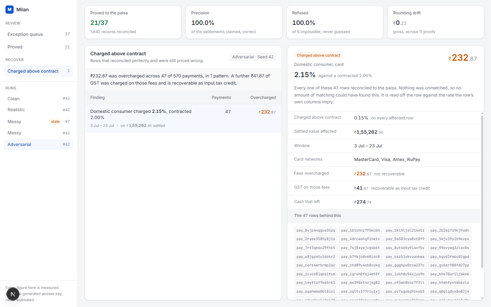
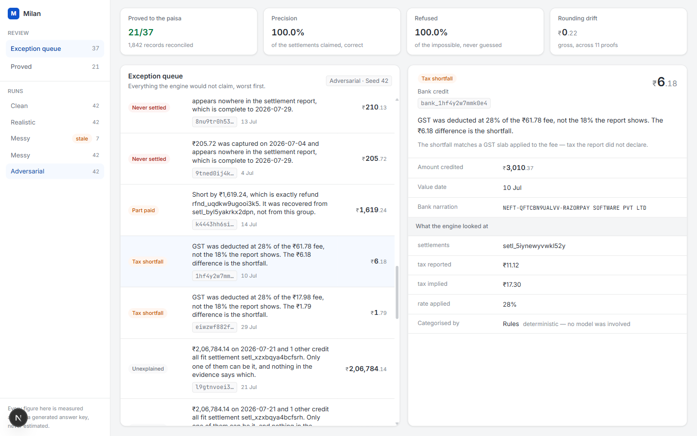
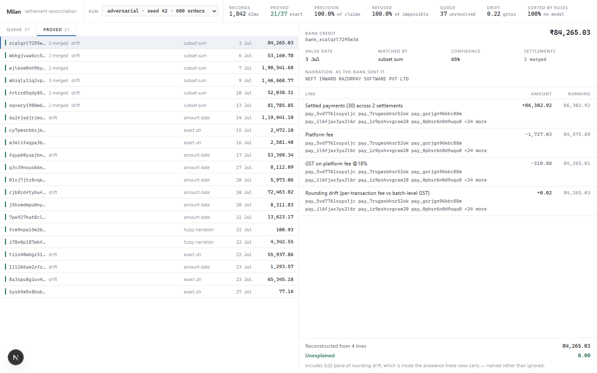

# Milan

**Settlement reconciliation that proves where every rupee went — and refuses to guess when it cannot.**

Razorpay AI Buildathon, Track 04 — AI Finance Controller.

---

## The problem

You run an online store. Last week you sold 100 orders worth Rs 95,000.
Today one deposit lands in your bank: **Rs 90,608.47**.

Two questions you cannot answer without opening a spreadsheet:

1. Which of my orders are inside this single deposit?
2. Where did the missing Rs 4,392 go?

At most Indian businesses, answering that is somebody's actual job, every week.

## What this does

Three inputs a merchant already has — the order book, the gateway settlement
report, and the bank statement — and one output: a complete, checked breakdown
of every bank credit.

```
Bank credit  Rs 90,608.47   (24 Aug)
 = 97 orders            Rs 95,000.00
 - Platform fee @2%     Rs  1,900.00
 - GST on fee @18%      Rs    342.00
 - refund  #4471        Rs    950.00
 - chargeback #2210     Rs  1,200.00
 - rounding drift       Rs      0.47   <- explained, not ignored
 = balances to zero
```

Every line points back at the source rows that justify it.

Most tools are **matchers** — they tell you what lined up. This is a **prover**:
a match that cannot be proved to the paisa is not reported as a match. It
becomes an exception, and the exception says what was missing.

## Status

Under active development for the 5 September 2026 deadline. The deterministic
engine, the exception queue and the model layer are built. No graded number
depends on the model, and that is now enforced by a test rather than promised
— see **Where the model earns its place** below. See
[docs/07-BUILD-ORDER.md](docs/07-BUILD-ORDER.md).

Measured numbers are published in the eval harness output and nowhere else.
No figure appears in this README that did not come out of a seeded run.

## Repository layout

| Path | Contents |
|---|---|
| [engine/](engine/) | Python: chaos generator, matching, waterfall solver, eval harness, API |
| [web/](web/) | Next.js: exception queue, settlement view, metrics |
| [docs/](docs/) | The plan, the money rules, the decisions log |
| `data/` | Generated datasets. Reproducible from a seed, never committed |

## Running it

The engine is a `uv` project. Everything is driven by one CLI.

```bash
cd engine
uv sync

uv run milan generate --seed 42 --difficulty realistic --orders 100
uv run milan recon
uv run milan eval
```

A `Makefile` at the repository root wraps the same commands for anyone who
prefers `make generate` / `make recon` / `make eval`. The CLI is the real
interface — the Makefile is a convenience, because `make` is not present on a
default Windows install and the project must not depend on it.

`recon` and `eval` refuse to run against a dataset this version of the
generator would not produce. A stored run is only meaningful because it is a
pure function of its seed and config; once the generator moves on, the file
still loads, still looks well formed, and describes a merchant the engine no
longer generates. So the config is written beside the data and checked on
load, and a mismatch tells you which command to re-run.

## Where it stands

Measured on 600 orders, seed 42, adversarial tier. Each row adds one rung, so
the gain over the row above it is what that rung is worth.

<!-- generated: eval -->
| Configuration | Match rate | Precision | Correct refusals | Shortfalls named |
|---|---|---|---|---|
| reference only (baseline) | 23.8% | 100.0% | 10/10 | 2/6 |
| + amount and date | 61.9% | 100.0% | 10/10 | 2/6 |
| + subset sum | 90.5% | 100.0% | 10/10 | 2/6 |
| + fuzzy narration | 100.0% | 100.0% | 10/10 | 3/6 |
| full cascade (+ shortfall) | 100.0% | 100.0% | 10/10 | 5/6 |
<!-- /generated -->

Four outcomes, not one. **Match rate** counts credits proved to the paisa.
**Refusals** counts credits that were impossible by design and correctly left
alone. **Shortfalls named** counts credits that are identifiable but *cannot*
be proved, because the payout disagrees with the report — for those the right
answer is never a match, it is an exception saying exactly what is missing and
why. The ones we cannot name lost their reference as well, so nothing could
identify which settlement was short; that is the correct output, not a miss.
This column is the weak one, and the section below says how weak.

The table above is printed by the command below rather than typed, and a test
fails if this file and a fresh run disagree. It is here because the numbers in
it were once retyped and quietly went stale.

Reproduce it:

```bash
uv run milan generate --seed 42 --difficulty adversarial --orders 600
uv run milan eval --seed 42 --difficulty adversarial --detail
```

### One seed is not a measurement

The table above is a single run, which is fine for the rungs — the match rate
moves by tens of credits and does not depend on which seed drew them. It is
not fine for the smaller figures. **Shortfalls named** has a denominator of
about six per run, and across twenty seeds it ranged from 67% to 100% while
everything else sat at 100%. Either end could have been published with a
straight face.

So the honest version pools the counts across twenty seeds rather than
averaging the rates, and reports the spread beside each figure:

<!-- generated: sweep -->
| Measure | Pooled | Of | Worst seed | Median | Best seed |
|---|---|---|---|---|---|
| match rate | 100.0% | 389/389 | 100.0% | 100.0% | 100.0% |
| settlement attributed | 98.0% | 499/509 | 92.3% | 100.0% | 100.0% |
| precision | 100.0% | 389/389 | 100.0% | 100.0% | 100.0% |
| refusal rate | 100.0% | 200/200 | 100.0% | 100.0% | 100.0% |
| shortfalls named | 91.7% | 110/120 | 66.7% | 100.0% | 100.0% |
| leaks caught | 100.0% | 762/762 | 100.0% | 100.0% | 100.0% |
| leak precision | 100.0% | 762/762 | 100.0% | 100.0% | 100.0% |
| merged credits resolved | 100.0% | 120/120 | 100.0% | 100.0% | 100.0% |
| missing payouts flagged | 100.0% | 40/40 | 100.0% | 100.0% | 100.0% |
| unsettled payments flagged | 100.0% | 153/153 | 100.0% | 100.0% | 100.0% |
<!-- /generated -->

```bash
uv run milan sweep --seeds 20 --difficulty adversarial
```

**Naming a shortfall is the weakest thing this system does — 91.7%, not the
100% one seed would have shown.** Everything else holds at 100% across twenty
seeds: 389 credits matched with nothing wrongly claimed, and 200 impossible
credits refused without a single forced answer.

**Two rates, because there are two questions.** *Match rate* asks whether a
credit was reconciled, and its denominator excludes credits that are
identifiable but cannot be reconstructed — the right output for those is an
exception, not a match. *Settlement attributed* asks whether the engine worked
out which payout a credit was, and it puts those credits back in. It is the
strictly harder number and it is 98.0%.

That second row exists because a measurement gap was found by reading
failures rather than totals. **A credit that failed to match *and* was
unprovable was scored only against explanation**, where it looked like a
naming problem — its matching failure had nowhere to be reported. Pooled over
twenty seeds, 43 credits were in exactly that position: their bank reference
was corrupted, no candidate was ever found, and they surfaced as *"no
settlement behind it"*.

They are attributed now, by a fifth rung that matches on a total being
**wrong**. A credit that arrived on the settlement date, short by an amount
inside what a fee stack could account for, is evidence — just not exact
evidence, and every rung above treats exactness as the whole of the evidence.
The band is read off the merchant's rate card (worst card rate, plus GST on
that fee, plus withholding where it applies) rather than tuned against the
data, because a tolerance fitted to the generator would be fitting to the
defects we chose to write.

Its claims are then **withdrawn by the prover, every time, by design.** It
matches on the total being wrong, so nothing it touches can pass proving —
which is why adding it moved shortfalls named from 64.2% to 91.7% and left
match rate, precision and the refusal count exactly where they were. What it
leaves behind is the settlement id, and that turns *"no settlement behind it"*
into *"this is settlement A and it is short by exactly refund R"*.

Ten credits across twenty seeds are still unattributed: too far short for any
fee stack to explain, or short by an amount that fits two payouts equally
well. Those are refused, and refusing them is the point.

Add `--withholding` to the generate command for a merchant subject to Section
194-O, where 1% of gross is withheld before the payout leaves.

The 100% is worth less than the 23.8%, and the reason is written up in
[docs/18-BUILD-LOG.md](docs/18-BUILD-LOG.md): a settlement total turns out to
be a near-unique fingerprint once the fee stack is modelled properly, so this
class of matching is easier than it looks. What is hard is proving a credit to
the paisa, refusing the ones the evidence cannot settle, and finding money
that is wrong while everything still balances.

### Does it hold as the data gets worse

Every figure above is from the adversarial tier, which is the honest choice
for a single number and says nothing about the shape of the curve. Same twenty
seeds, every tier:

<!-- generated: curve -->
| Measure | clean | realistic | messy | adversarial |
|---|---|---|---|---|
| match rate | 100.0% <sub>752/752</sub> | 100.0% <sub>613/613</sub> | 100.0% <sub>532/532</sub> | 100.0% <sub>389/389</sub> |
| settlement attributed | 100.0% <sub>752/752</sub> | 99.6% <sub>670/673</sub> | 99.3% <sub>608/612</sub> | 98.0% <sub>499/509</sub> |
| precision | 100.0% <sub>752/752</sub> | 100.0% <sub>613/613</sub> | 100.0% <sub>532/532</sub> | 100.0% <sub>389/389</sub> |
| refusal rate | - | 100.0% <sub>40/40</sub> | 100.0% <sub>100/100</sub> | 100.0% <sub>200/200</sub> |
| shortfalls named | - | 96.7% <sub>58/60</sub> | 95.0% <sub>76/80</sub> | 91.7% <sub>110/120</sub> |
| leaks caught | - | - | 100.0% <sub>434/434</sub> | 100.0% <sub>762/762</sub> |
| leak precision | - | - | 100.0% <sub>434/434</sub> | 100.0% <sub>762/762</sub> |
| merged credits resolved | - | 100.0% <sub>40/40</sub> | 100.0% <sub>80/80</sub> | 100.0% <sub>120/120</sub> |
| missing payouts flagged | - | 100.0% <sub>20/20</sub> | 100.0% <sub>40/40</sub> | 100.0% <sub>40/40</sub> |
| unsettled payments flagged | - | 100.0% <sub>47/47</sub> | 100.0% <sub>112/112</sub> | 100.0% <sub>153/153</sub> |
<!-- /generated -->

```bash
uv run milan curve --seeds 20 --orders 600
```

**Read the denominators, not the rates.** Three of these measures have nothing
to score on the clean tier - it generates no impossible credits, no merged
payouts and no mispriced rows - so they show a dash rather than a flattering
100%. A rate over an empty denominator is not a measurement.

Match rate and precision are flat, and that is a fact about this problem
rather than a compliment: a settlement total is close to a unique fingerprint
once the fee stack is modelled, so matching survives the reference being
destroyed. **The two rates that move are the two that should.** Working out
which payout a credit was falls from 100% to 98.0% as the defects pile up, and
naming why a payout came up short falls from 96.7% to 91.7%. Those are the
measures where the evidence genuinely thins, and a system that held 100% on
both across every tier would be evidence that the hard tier was not hard.

## The money that is wrong while everything balances

Every figure above answers one question: *did the payout arrive*. This answers
a different one, and it is the only question here that still has an answer
when the reconciliation is perfectly clean.

A domestic consumer card is contracted at 2%. The gateway charges 2.15%. The
settlement row foots. The batch total foots. The bank credit reconciles to the
paisa and the proof closes on zero. **Nothing is unmatched, so nothing looks
wrong** — which is exactly why this survives in real merchant accounts for
years, and why no matcher will ever find it.

It is found by reading a row against the *contract* rather than against
another row. The report declares a consumer card and carries a corporate-rate
fee, so it contradicts itself on a single line.

```
Rs 232.87 was overcharged across 47 of 570 payments, in 1 pattern.
A further Rs 41.87 of GST was charged on those fees and is recoverable
as input tax credit.

Finding                                              Payments  Overcharged
domestic consumer charged 2.15%, contracted 2.00%          47    Rs 232.87
  on Rs 1,55,262.30 settled, 2026-07-03 to 2026-07-23
  networks: MasterCard, Visa, Amex, RuPay
```

```bash
uv run milan leaks --seed 42 --difficulty adversarial
```

It has its own place in the workspace, filed apart from the queue rather
than inside it. An exception is something that did not reconcile; every row
behind these findings reconciled to the paisa, and filing them together would
bury the one result in the run that a clean reconciliation cannot hide.



**One finding, not forty-seven rows.** A list of small charges is technically
complete and nobody reads it. The sentence underneath — one rate pair, one
date range, one owner — is what a merchant takes to their account manager, and
every row behind it is kept so the claim can be checked against their own
export.

**The GST is stated separately on purpose.** It is real cash that left the
account, and for a GST-registered merchant it comes back as input tax credit.
Folding it into the headline would overstate the permanent loss by 18%, and
overstating harm is the same failure as understating it.

Scored against the answer key rather than demonstrated on an example: across
twenty adversarial seeds, **762 of 762 caught, with 762 of 762 precision.**
The second number is the one that matters. A missed leak costs a merchant
money they were already losing; a false one sends them to complain about an
overcharge that never happened, and there is no faster way for a tool like
this to stop being believed. The clean and realistic tiers contain no leaks
and the detector reports none — a detector that finds something everywhere has
learned to find nothing.

## The exception queue

Two halves of one honest answer, and a third list beside them. **Queue** is
what could not be resolved, and why — each case joined back to the record it
is about, with what the engine looked at before it gave up.



**Proved** is what could be, rebuilt line by line: the sale, every deduction
that happened to it, and a running total that lands exactly on what the bank
paid. Every line carries the source record ids behind it, so a finance team
can check it against their own export rather than take it on trust.



The last row is the point. `Unexplained  0.00` is the claim this project
makes, stated so it can be checked rather than believed.

**Charged above contract** is the third list, and it is the odd one out:
everything in it balanced. It is [shown above](#the-money-that-is-wrong-while-everything-balances),
in its own section, because it answers a different question from the other
two.

```bash
# terminal one
cd engine && uv run milan serve

# terminal two
cd web && npm install && npm run dev
```

Money crosses that API as integer paise and never as a float or a formatted
string; the browser does its own Indian-grouping arithmetic, tested against
the same table as the engine's. The API also refuses to serve the answer key —
a queue that can see the answers is a demo, and a test asserts it cannot.

The visual language is [Blade](https://github.com/razorpay/blade), the design
system behind the Razorpay dashboard. Its tokens are transcribed rather than
approximated, and money is set the way Blade sets it: the ₹ small, the rupees
large, the paise small and muted.

## Where the model earns its place

Four models sit behind one interface — two local through Ollama, two hosted
on free tiers — and every one of them is asked exactly one kind of question:
*why is this credit short?* None of them is believed.

**A model may propose. Only arithmetic may conclude.** It does not return
prose. It returns a typed claim naming a cause and a record that must already
exist in the report, and that claim is then put through the same arithmetic
the rule-based categoriser uses. A claim that does not foot to the paisa is
discarded before anything is printed.

### Four models, one verifier

Which makes the model's contribution a number rather than an adjective. The
same 110 shortfalls, in twenty adversarial seeds, every one of them already
named by the deterministic rules — put to two model sizes and two vendors,
through the same arithmetic:

| | Qwen 2.5 1.5B<br>local | Qwen 2.5 3B<br>local | Gemini 3.1<br>Flash Lite | Groq<br>gpt-oss-120b |
|---|---|---|---|---|
| questions answered | 110/110 | 110/110 | 110/110 | 107/110 |
| proposed a cause at all | 0 | 65 | 31 | 49 |
| **agreement with the rules** | 0.0% | 16.4% | 28.2% | **36.4%** |
| proposals rejected by arithmetic | 0 | 47 | 0 | 9 |
| **identifiers invented** | 0 | **5** | 0 | 0 |
| **contribution beyond the rules** | **0/0** | **0/0** | **0/0** | **0/0** |
| output tokens | 1,430 | 2,453 | 1,877 | 33,893 |

```bash
uv run milan ablate --provider ollama --seeds 20 --orders 600 --model qwen2.5:1.5b
uv run milan ablate --provider gemini --seeds 20 --orders 600 --max-tokens 512
uv run milan ablate --provider groq   --seeds 20 --orders 600 --max-tokens 512
```

**The last row is the same in every column, and it is the point.** Not one of
the four models reached a case the deterministic rules had left open, because
there were none: the rules name every shortfall the engine reaches on all four
tiers. Better models did not change a single published figure. They could not
— they are asked afterwards, and every answer goes through the arithmetic
before it counts.

That row is **0/0 rather than 0%**, and the distinction is the honest one:
there were no shortfalls left to attempt. It is a measured result and not an
assumption — measured with models actually running, because "the rules already
win" inferred from never switching one on is an argument from silence.

The 1.5B model returned valid schema on all 110 questions and answered
`unknown` to every one: a column of zeros that reads as caution and is really
absence. gpt-oss-120b is the strongest at the task and still disagrees with the
arithmetic on nine of its forty-nine proposals.

**The 3B model invented five identifiers** — refunds that exist nowhere in the
report. Had it been allowed to write the summaries, this system would have sent
a finance team through their ledger looking for records that were never there.
Every one was caught by the same arithmetic the rules use, cost nothing, and
never reached a screen.

Three of Groq's questions went unanswered: its free tier is 8,000 tokens a
minute and this model thinks in paragraphs, so three ran out of retries. They
are scored as **disagreements**, which makes 36.4% a floor rather than an
estimate.

**Nothing was spent, and the volume is measured anyway.** Token counts come
from each provider's own counters rather than an estimate, so the projection
is arithmetic on a measurement — only the rate is an assumption, and each rate
carries its source and the date it was read.

| run | tokens in / out | at Groq's rate | at Gemini's rate |
|---|---|---|---|
| Qwen 2.5 3B, local | 66,146 / 2,453 | $0.0114 | $0.0202 |
| Gemini 3.1 Flash Lite | 67,582 / 1,877 | $0.0113 | $0.0197 |
| Groq gpt-oss-120b | 64,628 / 32,357 | $0.0291 | $0.0647 |

**A thinking model costs twenty times the output for the same answer.** Every
answer here is one small JSON object; gpt-oss-120b writes a few hundred tokens
of reasoning before each one, and both vendors bill that as output. Gemini
reports those tokens in a separate field — `thoughtsTokenCount` — and counting
only what the model *said* would have understated its cost by an order of
magnitude, which is the direction an error is least likely to be questioned in.

Actual spend across every run in this section: **Rs 0.00.**

**A reader with no GPU and no key can reproduce all four columns.**
`data/llm-cache` holds what each model actually said, addressed by the hash of
the question — and the hash includes the model, which it did not until a
benchmark across two model sizes came back as two identical columns. Tests
replay every configuration with no provider present and assert these exact
figures.

**Switching models is one environment variable.** Which is worth stating in a
README rather than in a config file, because the claim it supports is that
nothing here depends on a particular vendor:

```bash
uv run milan providers                 # who could answer right now, and what to do about the rest

export GROQ_API_KEY=...                # free at console.groq.com
export GEMINI_API_KEY=...              # free at aistudio.google.com
uv run milan ablate --provider groq --seeds 20 --orders 600 --max-tokens 512
```

**Both hosted defaults had been retired by their vendors between being wired
in and being run.** `llama-3.3-70b-versatile` answers `model_not_found`;
`gemini-2.0-flash` answers 404 with a message naming its replacement. Both
were tested, against recorded response bodies, the whole time. `milan
providers` checks the model against the key's live catalogue now, because
"a key is set" and "this will answer" turned out to be different questions.

The flagship replacement is not the default either, and that is a quota rather
than a preference: `gemini-3.6-flash` allows twenty free requests a day, which
is one fifth of a single ablation. A run against it measures the quota.

An absent provider is not an error condition in this system: it answers
nothing, the explanations fall back to the deterministic summaries, and every
graded number is exactly where it was.

**The seal is structural.** `milan.recon`, `milan.domain` and `milan.chaos`
produce every published figure, and none of them may import `milan.llm`. A
test parses their imports and fails if one ever does, because a claim like
this is true when written and quietly stops being true nine commits later.

### Run it twice, two different books

The other half of the reproducibility claim. Milan's output does not move,
and `milan reproduce` makes that falsifiable. This is what happens when the
answers come from a model instead - the same thirty questions, asked twice,
nothing else changed:

| configuration | answers that moved | named a different record |
|---|---|---|
| temperature 0, seed left to the daemon | 0/30 | 0 |
| temperature 0.7, seed pinned | 0/30 | 0 |
| **temperature 0.7, seed left to the daemon** | **11/30** | **4** |

```bash
uv run milan twice --seeds 6 --questions 30 --temperature 0.7 --no-pin
```

The finding is not "models are random". It is that **reproducibility with a
model is conditional, and the conditions are not the defaults**: greedy
decoding, or a pinned sampler seed, and Gemini's API offers no seed parameter
to pin at all. Milan pins both and needs neither, because nothing on the third
row could have reached a figure in this README - the arithmetic had already
concluded before the model was asked.

Four of those eleven blamed a different refund the second time. On a system
that let the model conclude, that is two different sets of books from one
input.

## Cascade, not agent - and that is a measurement

This project calls itself a cascade: five rungs tried in a fixed order, no
planning, no choice about what to try next. That is a less impressive noun
than the alternative, and the build order's own cut rule says it has to be
earned - **until an adaptive matcher has been measured against the fixed one,
this is a cascade and never an agent.**

So here is the adaptive matcher, written to win if it could. Same rungs, same
verifier, same scorer; the only difference is who decides what to try next. It
routes per credit on three cheap features, skips rungs that cannot succeed on
the evidence a credit carries, keeps state about which rungs are spent, and
re-passes until nothing new resolves.

<!-- generated: control -->
| Measure | cascade (fixed order) | adaptive (routed per credit) |
|---|---|---|
| match rate | 100.0% (389/389) | 100.0% (389/389) |
| settlement attributed | 98.0% (499/509) | 97.4% (496/509) |
| precision | 100.0% (389/389) | 100.0% (389/389) |
| refusal rate | 100.0% (200/200) | 100.0% (200/200) |
| shortfalls named | 91.7% (110/120) | 89.2% (107/120) |
| merged credits resolved | 100.0% (120/120) | 100.0% (120/120) |
| **rung attempts** | **2,488** | **4,975** |
| **matching time** | **0.64s** | **3.63s** |
<!-- /generated -->

```bash
uv run milan control --seeds 20 --orders 600
```

**It never wins.** It ties on the three easier tiers, loses three attributions
and three named shortfalls on the adversarial one, and asks the rungs for
**twice the work** to get there. On the clean tier the two are identical at
1.00x - every credit resolves at rung one, so there is nothing to route.

The reason is worth more than the result. Each time the adaptive arm fell
behind, the repair was to hand it something the fixed order was already
providing for free:

| what had to be added | what the cascade gets for nothing |
|---|---|
| an evidence rank to break collisions | rung order - a reference claim is banked before an amount claim is made |
| blocking a rung after a lost collision | falling through to the next rung |
| repeated passes until nothing changes | one pass, rung by rung |

**Choosing per credit destroys the global ordering that made choosing
unnecessary.** A weak-evidence claim and a strong-evidence one never meet
under a fixed order, because the strong one is already settled; routing
manufactures exactly those collisions and then needs a priority rule to undo
them - and that priority rule is the cascade's rung order, reintroduced by
hand and paid for twice.

That is why the word here is cascade. Not modesty - arithmetic.

## Design stance

**Precision beats recall.** A wrong silent match corrupts a merchant's books.
A flagged exception costs a human five minutes. When the evidence does not
support an answer, the system says so.

That is not a slogan: the generator deliberately produces records that are
impossible to resolve, and the eval harness scores whether the engine correctly
refuses them. Forcing a match onto one is counted as a false positive, **even
when the forced answer happens to be right**.

**Proving beats matching.** A match is a claim; a proof is evidence. Every
claim is checked against the waterfall before it is accepted, and a claim that
cannot be reconstructed to zero is withdrawn — which is how a bank credit that
merges two payouts, and carries one of their reference numbers, avoids being
filed confidently against the wrong settlement.

## Documentation

Start at [docs/00-START-HERE.md](docs/00-START-HERE.md).
